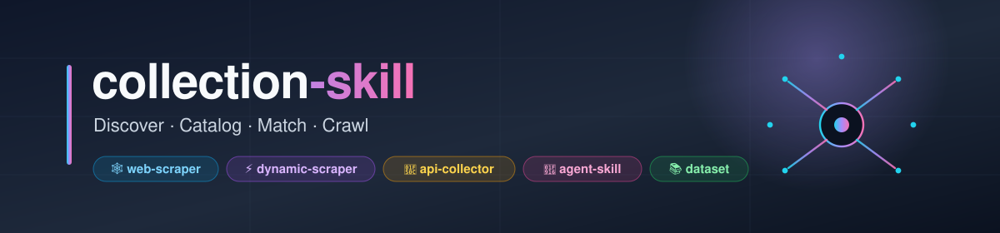
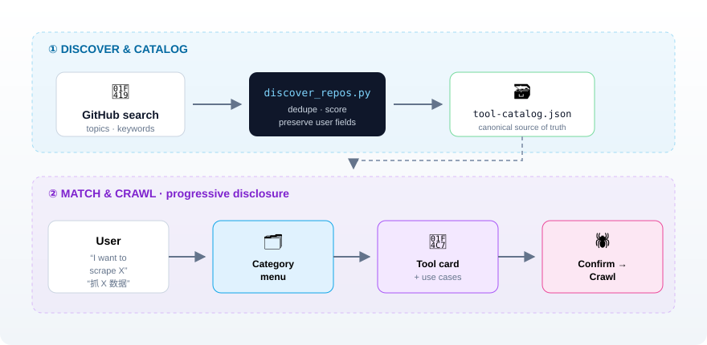
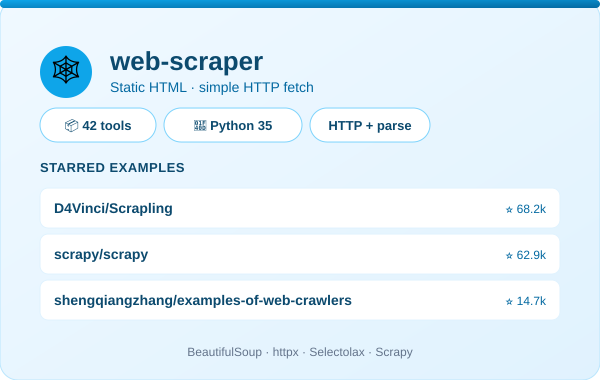
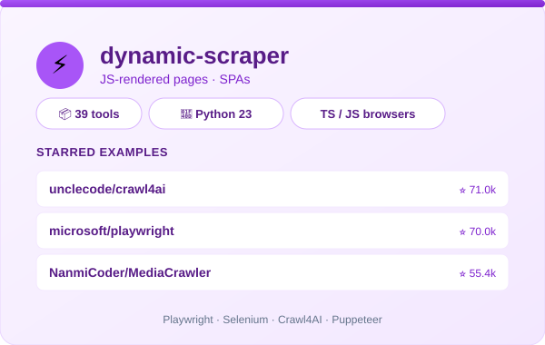
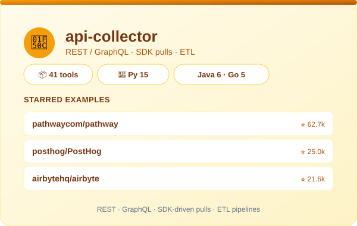
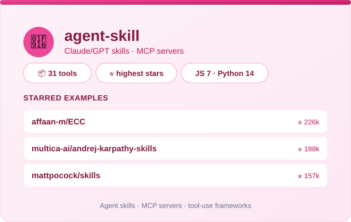
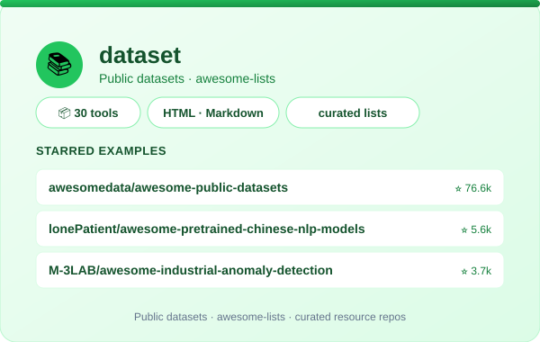

<p align="center">
  
</p>

<!-- TODO(demo): record docs/demo.gif per docs/demo-storyboard.md, then uncomment.
<p align="center">
  
</p>
-->

<h3 align="center">
  发现 · 编目 · 匹配 · 抓取
</h3>

<p align="center">
  <a href="README.md">English</a> ·
  <a href="README.zh-CN.md">简体中文</a> ·
  <a href="README.ja.md">日本語</a> ·
  <a href="README.es.md">Español</a>
</p>

<p align="center">
  
  
  
  
  
  <a href="https://github.com/Yuuqq/collection-skill/actions/workflows/discover.yml"></a>
</p>

---

> 一个**发现并编目 GitHub 上采集 / 爬虫类 skill 与仓库**的技能,在你需要抓取数据时**渐进式推荐合适工具并开始抓取**。

## ✨ 特性一览

| | |
|:--|:--|
| 🗂️ **精选编目** | 自动发现 GitHub 仓库,归入**五大标准类目**,自动去重并打分排序。 |
| 🧭 **渐进式披露** | 绝不一股脑倾倒整个编目 —— 类目菜单 → 工具卡片 → 工作流 → 抓取。 |
| 🗃️ **JSON 为本** | `tool-catalog.json` 是唯一权威数据源,Markdown 视图由脚本生成。 |
| 🔐 **默认安全** | 令牌从 `gh` 密钥环 / 环境变量读取 —— 仓库内不留任何凭据。 |
| ⏱️ **可定时** | 通过 cron / 任务计划程序安装周期性刷新。 |

## 📥 安装

兼容所有支持开放 [Agent Skills](https://agentskills.io) 规范的智能体 —— Claude Code、Cursor、Codex 等:

```bash
npx skills add Yuuqq/collection-skill
```

<details>
<summary>手动安装(git clone)</summary>

克隆到你的智能体 skills 目录:

```bash
# Claude Code(个人级)
git clone https://github.com/Yuuqq/collection-skill.git ~/.claude/skills/collection-skill

# Cursor
git clone https://github.com/Yuuqq/collection-skill.git ~/.cursor/skills/collection-skill

# Codex
git clone https://github.com/Yuuqq/collection-skill.git ~/.codex/skills/collection-skill

# 或项目级: .claude/skills/ · .cursor/skills/ · .codex/skills/
```

</details>

> 发现脚本需要 Python 3.10+;建议用 [`gh` CLI](https://cli.github.com/) 或 `GITHUB_TOKEN` 认证以获得更高的 GitHub API 限额。

## 📦 它做什么

两半共享**同一个知识库**:

<p align="center">
  
</p>

### ① 发现 & 编目
周期性扫描 GitHub,寻找*采集类*仓库,归入五大类目:

| 标签 | 含义 | 示例 |
|-----|------|------|
| 🕸️ `web-scraper` | 静态 HTML / 简单 HTTP 抓取 | BeautifulSoup、httpx、Selectolax、Scrapy |
| ⚡ `dynamic-scraper` | JS 渲染页面、SPA | Playwright、Selenium、Crawl4AI |
| 🔌 `api-collector` | REST/GraphQL、SDK 拉取、ETL | SDK 驱动的采集器、数据管道 |
| 🤖 `agent-skill` | Claude/GPT 技能、MCP 服务器 | 工具调用框架 |
| 📚 `dataset` | 公开数据集、awesome 列表 | 精选资源仓库 |

### ② 匹配 & 抓取
当你说*"我想抓 X"* 时,它会走一条短漏斗:

```
类目菜单  →  工具卡片  →  加载工作流  →  确认范围  →  抓取
```

## 📊 编目概览

> 由 `tool-catalog.json` 自动生成 · 最近刷新 `2026-08-24`

| 类目 | 数量 | | 主要语言 |
|------|----:|---|----------|
| 🕸️ web-scraper | 41 | | Python · Java · Jupyter Notebook |
| 🔌 api-collector | 25 | | Python · TypeScript · JavaScript |
| ⚡ dynamic-scraper | 44 | | Python · TypeScript · HTML |
| 🤖 agent-skill | 18 | | Python · TypeScript · JavaScript |
| 📚 dataset | 28 | | Python · HTML · JavaScript |
| **合计** | **156** | | **Python(85)** 居首 |

> 🆕 **每周都有新工具入库。** 目录每周自动刷新 —— 在[每周 digest](../../releases) 中查看本周新增。Watch 本仓库即可收到通知。

## 🎴 类目卡片

<table>
  <tr>
    <td width="50%" align="center"><br><sub><a href="docs/card-web-scraper.svg">🕸️ web-scraper · 41 个工具</a></sub></td>
    <td width="50%" align="center"><br><sub><a href="docs/card-dynamic-scraper.svg">⚡ dynamic-scraper · 44 个工具</a></sub></td>
  </tr>
  <tr>
    <td width="50%" align="center"><br><sub><a href="docs/card-api-collector.svg">🔌 api-collector · 25 个工具</a></sub></td>
    <td width="50%" align="center"><br><sub><a href="docs/card-agent-skill.svg">🤖 agent-skill · 18 个工具</a></sub></td>
  </tr>
  <tr>
    <td colspan="2" align="center"><br><sub><a href="docs/card-dataset.svg">📚 dataset · 28 个工具</a></sub></td>
  </tr>
</table>

## 🚀 用法

唤起该技能后,自然语言即可:

| 你说 | 会发生什么 |
|------|-----------|
| `refresh` / `discover` / `刷新` | 运行 `scripts/discover_repos.py`,更新编目 |
| `我想抓 X` / `抓 X 数据` | 渐进式披露 → 类目菜单 → 卡片 → 抓取 |
| `browse` / `看看编目` | 只读的类目/卡片视图 |
| `schedule` / `定时` | 安装周期性刷新(cron / 任务计划程序) |

## 🛠️ 快速开始

```bash
# 1.(推荐)认证 —— 30 次/分钟 搜索请求,未认证仅 10 次/分钟
gh auth login

# 2. 首次刷新
python scripts/discover_repos.py
python scripts/build_catalog_md.py

# 3.(可选)安排每周刷新 —— 唤起技能并说 "定时刷新"
```

## 🤖 LLM 智能判级(可选)

设置 `LLM_API_KEY` 后,发现流程会把每个候选仓库发给 **OpenAI 兼容接口**,由其判断**是否纳入**并**归入哪个分类**(覆盖搜索关键词推测的分类),同时补全 1–3 条适用场景。默认端点为 Sensenova 兼容 API,可用 `LLM_BASE_URL` / `LLM_MODEL` 覆盖;未设置 key 时自动退回基于星标与关键词的启发式逻辑。Key 支持 `;` 分隔的密钥池,按请求随机选取以摊匀限流。

仓库已内置 GitHub Action(`.github/workflows/discover.yml`),按 `cron` 每周自动检索并刷新目录;在仓库 **Settings → Secrets** 中配置 `GH_PAT`、`LLM_API_KEY`(及可选的 `LLM_BASE_URL` / `LLM_MODEL`)即可启用,也可在 Actions 页面手动 `workflow_dispatch` 触发。

## 🗺️ 项目结构

```
collection-skill/
├── SKILL.md                       # 路由 + 核心原则
├── workflows/
│   ├── discover-catalog.md        # 从 GitHub 刷新
│   ├── match-and-crawl.md         # 渐进式披露 → 抓取
│   ├── browse-catalog.md          # 只读视图
│   └── schedule-refresh.md        # 安装周期性刷新
├── references/
│   ├── tool-catalog.json          # 权威数据(在此编辑)
│   ├── tool-catalog.md            # 生成的视图(请勿手改)
│   ├── discovery-log.md           # 只追加的运行历史
│   ├── category-keywords.md       # 每类目的搜索关键词
│   ├── repo-schema.md             # 条目结构
│   └── rate-limit-guide.md        # GitHub API 限额
├── templates/
│   ├── crawl-template.md          # 通用抓取工作流
│   ├── discovery-log-entry.md
│   └── run_scheduled_refresh.sh.template
├── scripts/
│   ├── discover_repos.py          # GitHub 搜索 → 编目
│   ├── build_catalog_md.py        # JSON → Markdown
│   └── add_repo.py                # 手动添加条目
└── docs/                          # README 横幅与图示
```

## ⚖️ 设计规则

- **JSON 为本。** `tool-catalog.md` 由 `build_catalog_md.py` 重新生成 —— 切勿手改。
- **渐进式披露。** 先类目,再卡片,选定工具后才加载工作流。
- **仓库不留凭据。** 令牌来自 `$GITHUB_TOKEN` 或 `gh auth token`。
- **保留用户字段。** 重新发现时永不覆盖 `notes`、`verified`、`favorite`、`workflow_file`。
- **尊重边界。** 遵守 `robots.txt`、速率限制与服务条款;抓取新域名前先确认范围。

## 🤝 贡献一个工具

知道某个好用但还没收录的爬虫、采集器、agent skill 或数据集？30 秒即可提交：

- **开一个[工具收录 issue](../../issues/new?template=submit-tool.yml)** —— 我们会审核并收录（每周自动刷新也会顺带收入）。
- **或直接提 PR** —— 编目规则与单工具 workflow 的写法见 [CONTRIBUTING.md](CONTRIBUTING.md)。

每一次提交都让目录对所有人更有用。🙌

## 🌍 多语言版本

| 语言 | 文件 |
|------|------|
| English | [`README.md`](README.md) |
| 简体中文 | [`README.zh-CN.md`](README.zh-CN.md) |
| 日本語 | [`README.ja.md`](README.ja.md) |
| Español | [`README.es.md`](README.es.md) |

## 📄 许可证

MIT —— 见 [LICENSE](LICENSE)。
